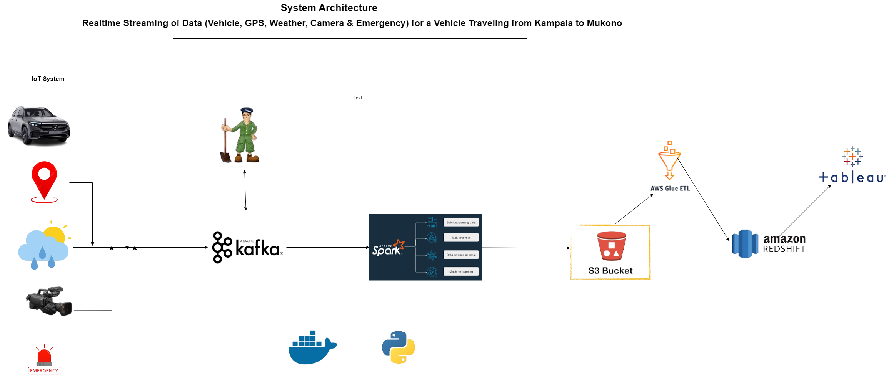

# Realtime Streaming of Data from IoT Devices to AWS

## Project Description

This project focuses on streaming data from IoT devices installed on a vehicle moving from Kampala to Mukono. The data, including vehicle data, weather data, location data, emergency data, and camera data, is streamed in real-time to an AWS S3 bucket. Following this, an ETL process is performed, and the transformed data is stored in an Amazon Redshift Data Warehouse.

## Table of Contents

- [Installation](#installation)
- [Usage](#usage)
- [Features](#features)
- [Technology Stack](#technology-stack)
- [Prerequisites](#prerequisites)
- [Contributing](#contributing)
- [License](#license)



## Installation

To set up this project locally, follow these steps:

1. **Clone the repository:**

   ```bash
   git clone https://github.com/KofiAnaan0/smartcity.git
   ```

2. **Navigate to the project directory:**

   ```bash
   cd project-name
   ```

3. **Create & activate a virtual environment(optional):**

   ```bash
   python -m virtualenv env
   ```

   ```bash
   ./env/Scripts/activate
   ```

4. **Install the dependencies:**

   ```bash
   pip install -r requirements.txt
   ```

5. **Create the Docker application:**
   ```bash
   docker-compose up -d
   ```

## Usage

To use this project:

1. **Produce the data to Kafka:**

   - Simulate or gather data from IoT devices and produce it to the Kafka topic.

2. **Stream the data from Kafka to AWS S3 bucket using PySpark:**

   - Utilize PySpark to process the streaming data and send it to the designated S3 bucket.

3. **Perform ETL on the data using AWS Glue:**

   - Transform the data using AWS Glue and prepare it for loading.

4. **Load the data into Amazon Redshift:**
   - Finally, load the transformed data into the Amazon Redshift data warehouse for storage and analysis.

## Features

- **Real-time Data Streaming:** Stream various types of vehicle-related data in real-time.
- **Scalable ETL Process:** Perform scalable ETL using AWS Glue.
- **Data Warehousing:** Store transformed data in Amazon Redshift for further analysis.
- **Dockerized Application:** Simplify deployment using Docker.

## Technology Stack

- **Docker**
- **Python**
- **SQL**
- **AWS:** Redshift, S3 Bucket, Glue
- **Kafka**
- **PySpark**

## Prerequisites

Before starting, ensure you have:

- **Basic knowledge of:**
  - Docker
  - AWS (Glue, S3 Bucket, Redshift)
  - Python
  - SQL

## Contributing

Contributions are welcome! Please follow these steps:

1. Fork the repository.
2. Create a new branch (`git checkout -b feature/YourFeature`).
3. Commit your changes (`git commit -m 'Add YourFeature'`).
4. Push to the branch (`git push origin feature/YourFeature`).
5. Open a Pull Request.

## License

This project is licensed under the MIT License - see the [LICENSE](LICENSE) file for details.
